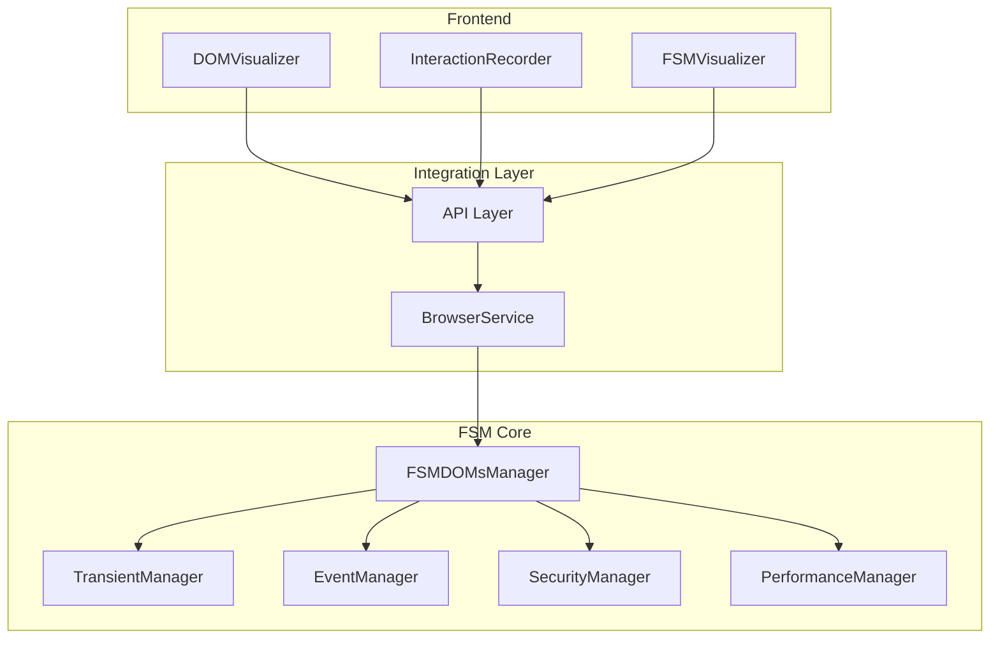
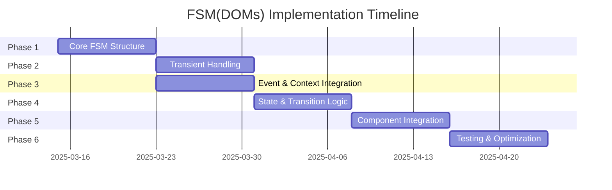
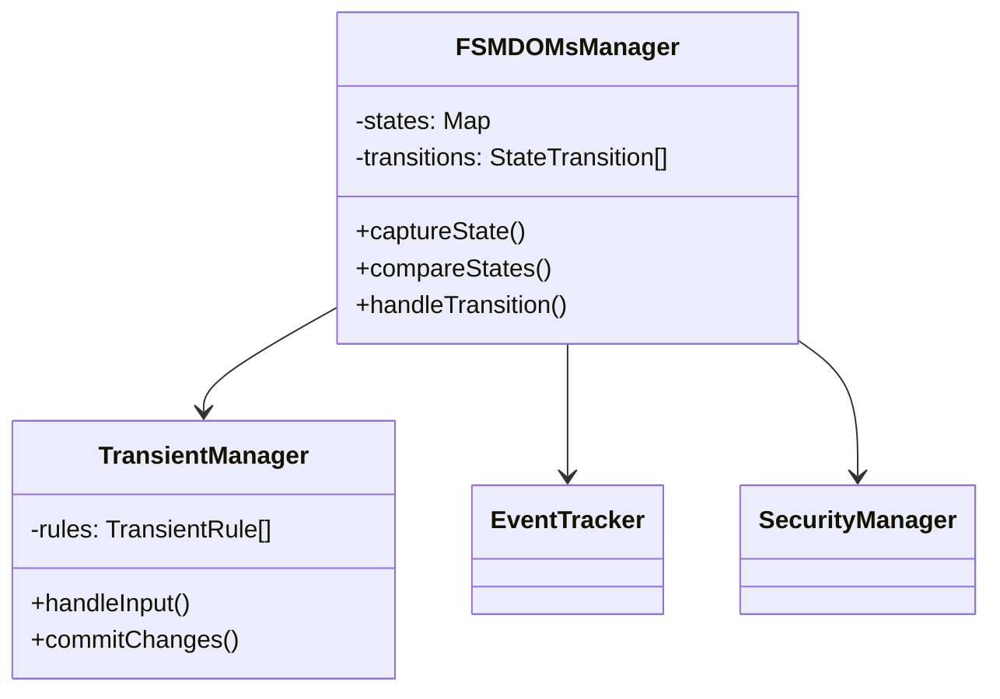
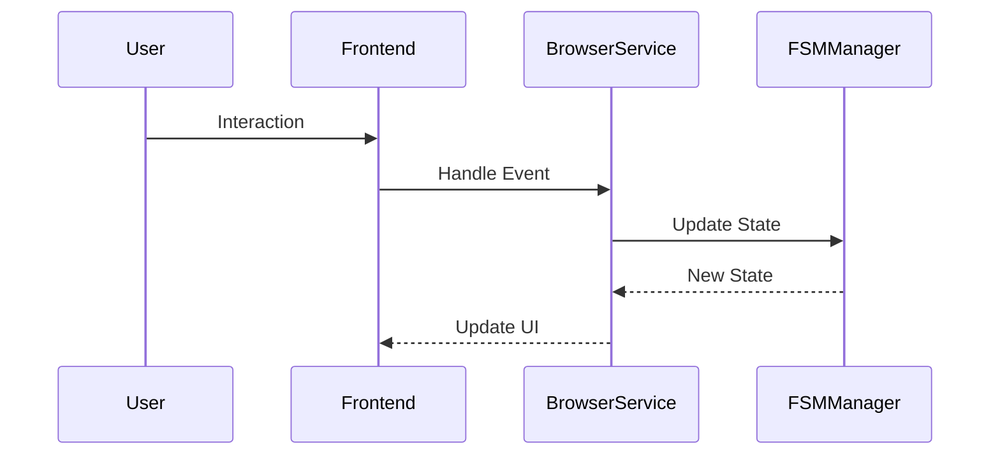

# FSM(DOMs) Implementation Project Summary

## Project Overview
Implementation of FSM(DOMs) formal model for web application state management, integrating DOM structure, security context, and performance metrics into a unified finite state machine framework.

## Architecture Overview

## Implementation Phases

### Phase 1: Core FSM Structure
- Core data structures and base classes
- State management foundation
- Basic state capture and storage
- **Timeline**: 8 days
- **Dependencies**: None

### Phase 2: Transient Attribute Handling
- Transient state management
- Form input handling
- State transition guards
- **Timeline**: 8 days
- **Dependencies**: Phase 1

### Phase 3: Event and Context Integration
- Event listener tracking
- Security context integration
- Performance metrics collection
- **Timeline**: 8 days
- **Dependencies**: Phase 1

### Phase 4: State Comparison and Transition Logic
- State equivalence implementation
- Transition function logic
- State history management
- **Timeline**: 8 days
- **Dependencies**: Phases 1-3

### Phase 5: Integration with Existing Components
- Enhanced BrowserService
- Updated DOMVisualizer
- Modified InteractionRecorder
- **Timeline**: 8 days
- **Dependencies**: Phases 1-4

### Phase 6: Testing and Optimization
- Comprehensive testing
- Performance optimization
- Memory management
- **Timeline**: 8 days
- **Dependencies**: Phases 1-5

## Project Timeline

## Key Components and Relationships

### 1. Core FSM Components

### 2. Integration Flow

## Implementation Strategy

### 1. Incremental Development
- Each phase builds upon previous phases
- Continuous integration of new features
- Regular testing and validation

### 2. Testing Approach
- Unit tests for each component
- Integration tests for phase completion
- End-to-end testing for user flows
- Performance benchmarking

### 3. Quality Metrics
- Test coverage > 90%
- Performance within specified limits
- Memory usage optimization
- Code quality standards

## Success Criteria

### 1. Functional Requirements
- Accurate state tracking
- Proper transient handling
- Efficient state transitions
- Comprehensive event tracking

### 2. Performance Requirements
- State capture < 100ms
- State comparison < 50ms
- Memory usage < 100MB
- Smooth UI updates

### 3. Quality Requirements
- No memory leaks
- Stable performance
- Proper error handling
- Comprehensive logging

## Risk Management

### 1. Technical Risks
- Performance degradation
- Memory management issues
- Integration complexity
- Browser compatibility

### 2. Mitigation Strategies
- Regular performance monitoring
- Memory profiling and optimization
- Phased integration approach
- Cross-browser testing

## Next Steps

1. Begin Phase 1 implementation:
   - Set up project structure
   - Create core FSM classes
   - Implement basic state management
   - Add initial tests

2. Regular review points:
   - Daily progress tracking
   - Weekly phase reviews
   - Performance benchmarking
   - Code quality checks

3. Documentation maintenance:
   - Update technical specs
   - Document API changes
   - Maintain test documentation
   - Track architectural decisions