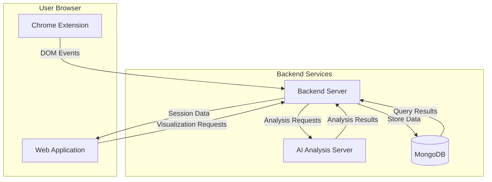
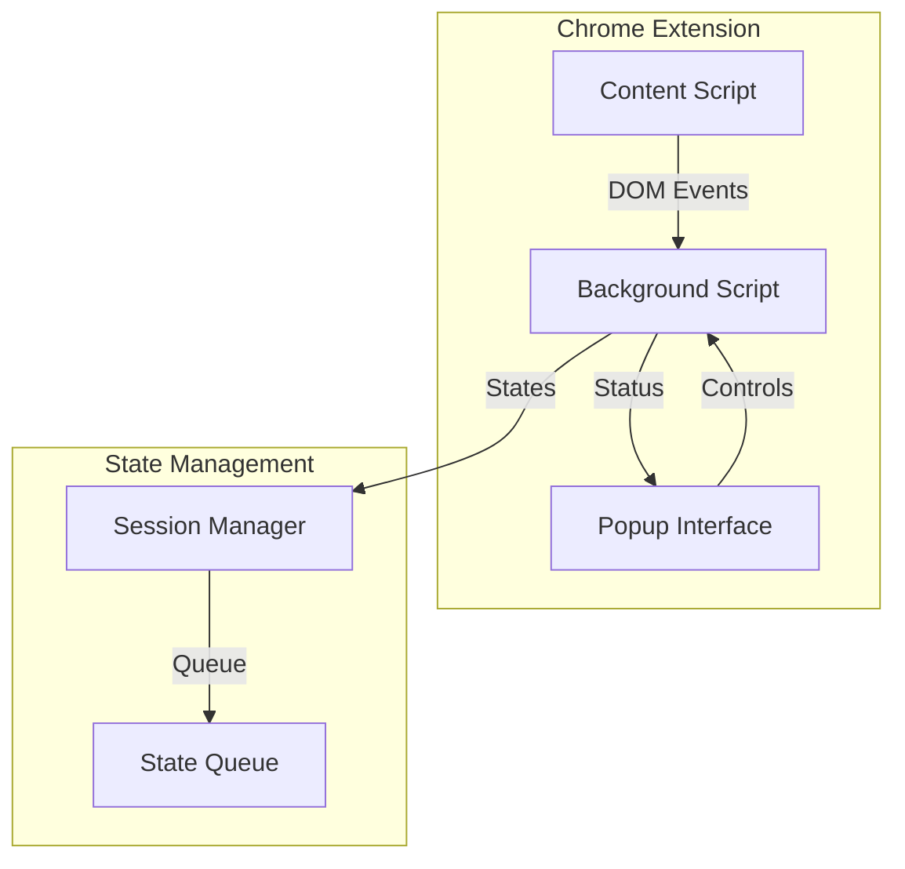
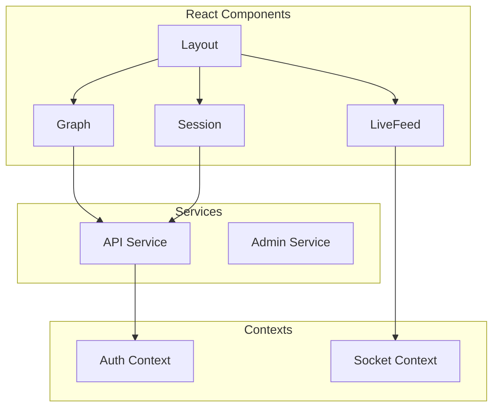
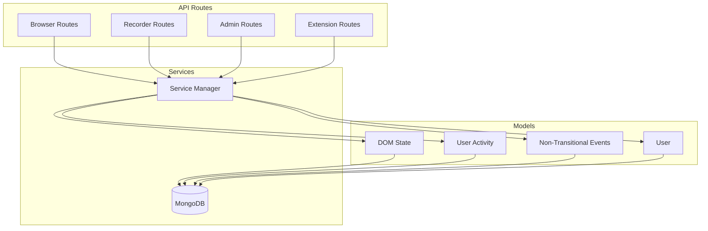
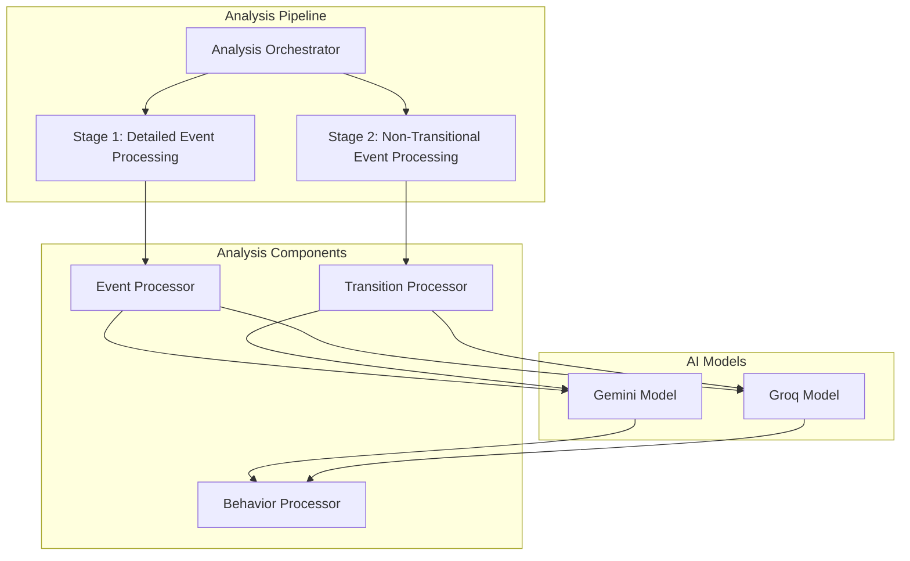
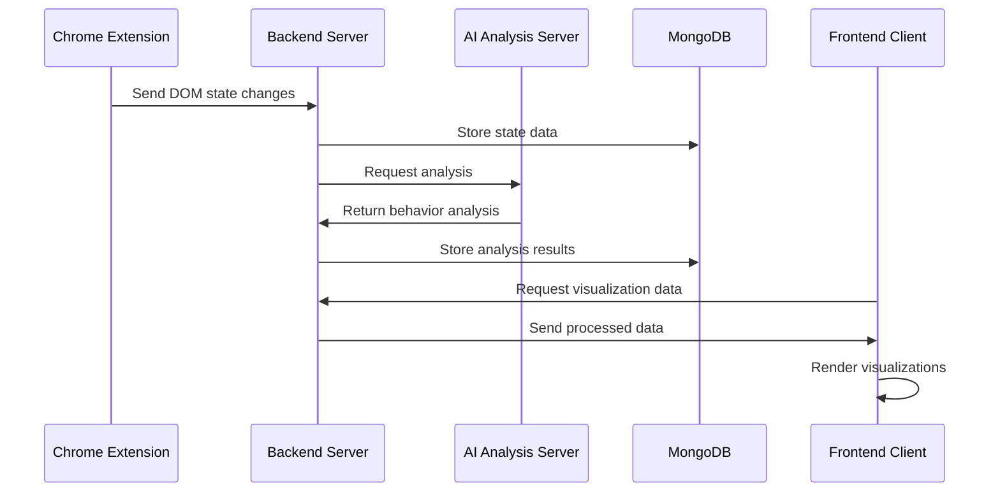
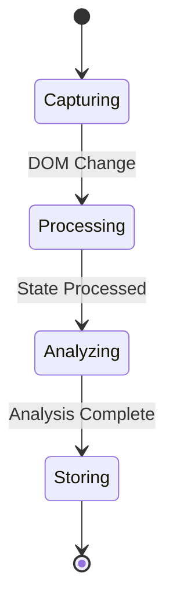
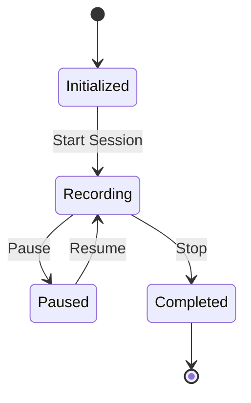

# Complete System Architecture Documentation

## Table of Contents
1. [System Overview](#system-overview)
2. [Component Architecture](#component-architecture)
3. [Data Flow Architecture](#data-flow-architecture)
4. [AI Analysis Pipeline](#ai-analysis-pipeline)
5. [State Management](#state-management)
6. [Technical Stack](#technical-stack)
7. [Security Architecture](#security-architecture)
8. [Performance Considerations](#performance-considerations)
9. [Integration Points](#integration-points)

## System Overview

This system is a comprehensive web application for tracking, recording, and analyzing DOM state changes and user interactions. It consists of four main components:

### Key Components
1. **Chrome Extension**: Captures DOM states and user interactions
2. **Frontend Client**: React/TypeScript visualization interface
3. **Backend Server**: Node.js/Express API server
4. **AI Analysis Server**: Specialized server for behavioral analysis

## Component Architecture

### 1. Chrome Extension Architecture

Key Features:
- Background Script: Session and state management
- Content Script: Real-time DOM monitoring
- Popup Interface: User controls
- State Queue: Efficient state processing

### 2. Frontend Client Architecture

Key Features:
- React/TypeScript implementation
- Component-based architecture
- Context-based state management
- Service abstraction layer

### 3. Backend Server Architecture

### 4. AI Analysis Server Architecture

## Data Flow Architecture

## AI Analysis Pipeline

The AI analysis system processes user sessions through multiple stages:

1. **Stage 1: Detailed Event Processing**
   - Event sequence analysis
   - State transition mapping
   - User interaction patterns
   - Form interaction analysis

2. **Stage 2: Non-Transitional Event Processing**
   - Loading state analysis
   - Network performance correlation
   - DOM fingerprint analysis
   - Form behavior patterns

Key Features:
- Multi-model support (Gemini/Groq)
- Comprehensive session analysis
- Behavior pattern detection
- Performance impact analysis

## State Management

### DOM State Processing

### Session Management

## Technical Stack

### Frontend
- React 18+
- TypeScript
- Vite
- Socket.IO Client

### Backend
- Node.js
- Express
- MongoDB
- Socket.IO

### AI Analysis
- Gemini AI
- Groq
- Custom Analysis Pipeline

### Extension
- Chrome Extensions API
- JavaScript
- DOM Mutation Observer

## Security Architecture

1. **Authentication**
   - JWT-based auth
   - Protected routes
   - Role-based access

2. **Data Protection**
   - CORS configuration
   - Request validation
   - Sanitized inputs

3. **API Security**
   - Rate limiting
   - API key management
   - Request validation

## Performance Considerations

1. **State Processing**
   - Efficient state diffing
   - Duplicate state detection
   - Batch processing

2. **Data Storage**
   - Optimized schemas
   - Indexed queries
   - Efficient data structures

3. **Analysis Pipeline**
   - Parallel processing
   - Caching mechanisms
   - Resource management

## Integration Points

1. **Extension Integration**
   - Chrome Web Store deployment
   - Browser compatibility
   - Update management

2. **API Integration**
   - RESTful endpoints
   - WebSocket connections
   - Event streams

3. **AI Service Integration**
   - Model API integration
   - Analysis pipeline hooks
   - Result processing

This architecture documentation provides a comprehensive overview of the system's components, their interactions, and key technical considerations. The system is designed to be scalable, maintainable, and efficient in processing and analyzing user interaction data.