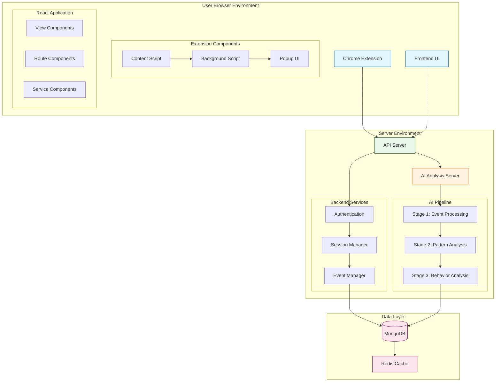
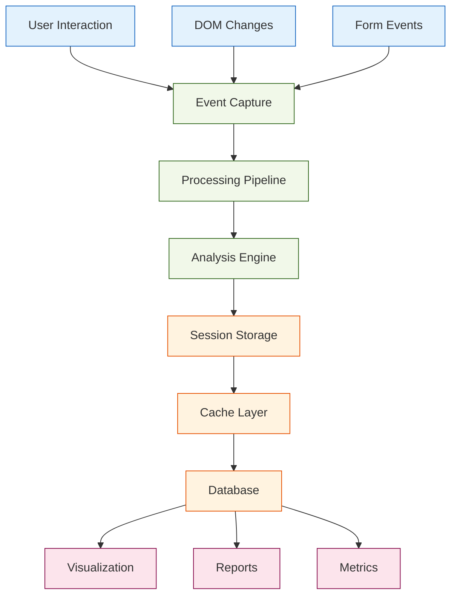
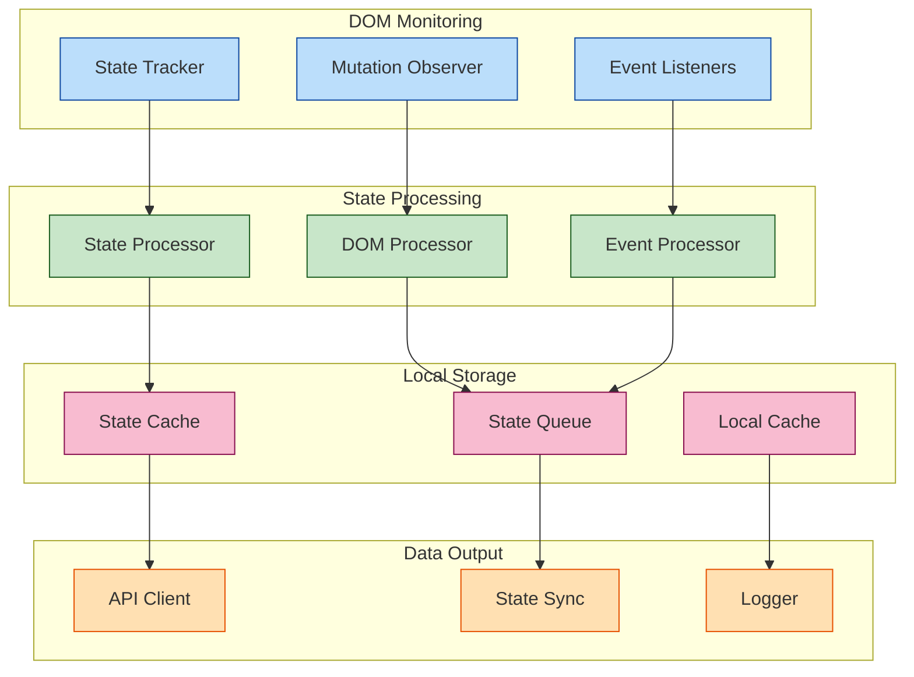
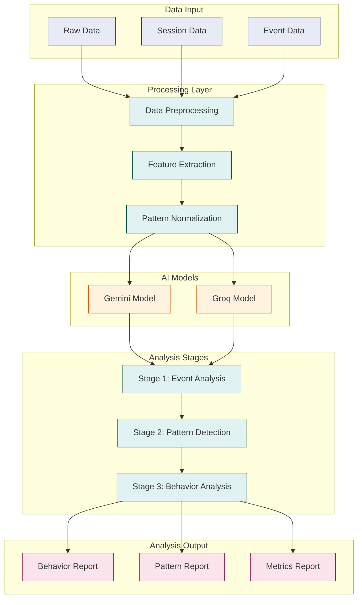
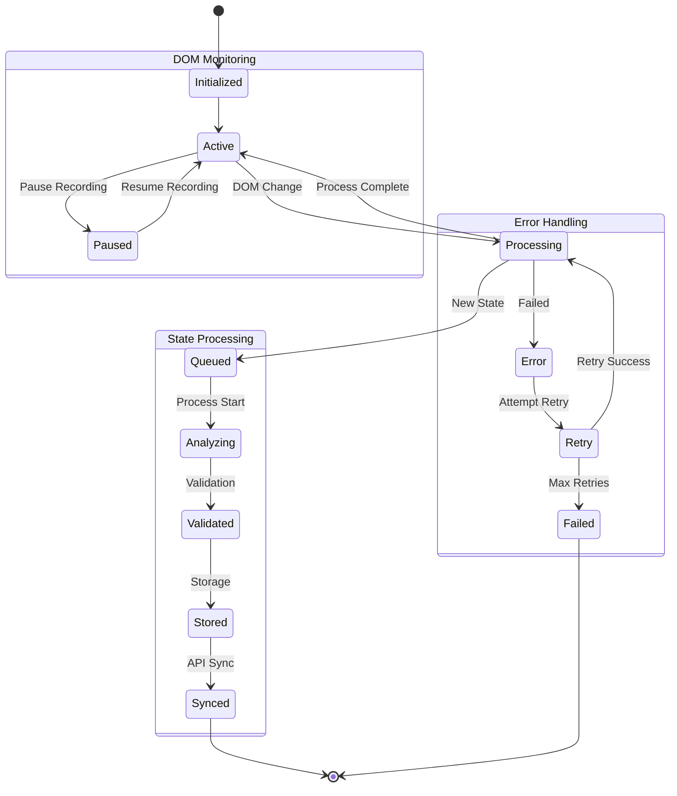
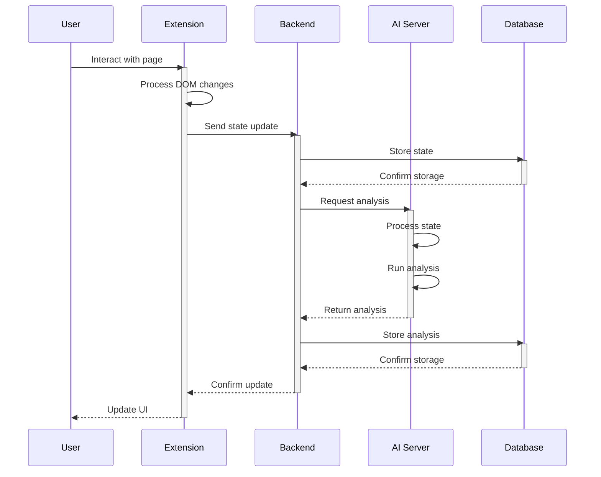
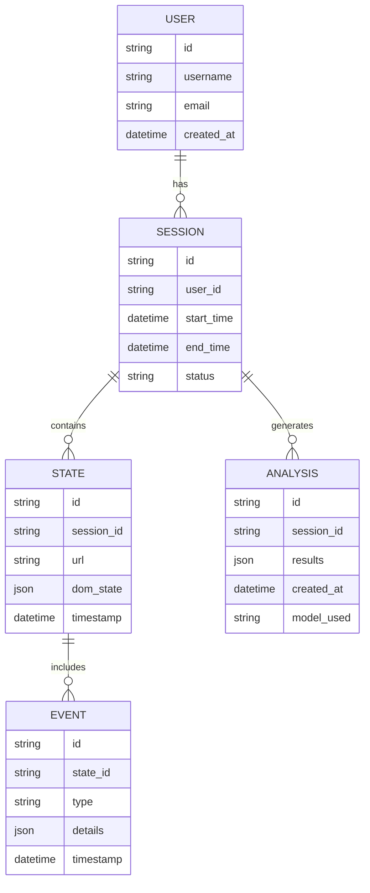
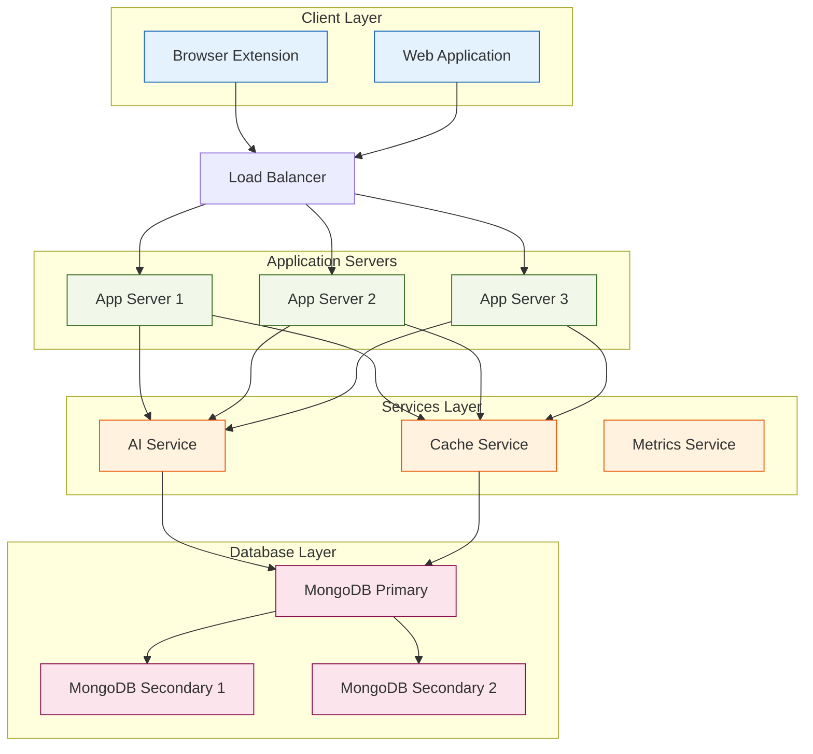

# System Architecture Diagrams

## 1. Complete System Overview

## 2. Data Flow Pipeline

## 3. Extension Architecture Detail

## 4. AI Analysis Pipeline Detail

## 5. State Management Flow

## 6. Component Interaction Detail

## 7. Database Schema Overview

## 8. Network Architecture

This comprehensive set of diagrams provides a detailed visual representation of the system's architecture, showing component relationships, data flows, and system interactions at various levels of abstraction.

Each diagram focuses on a specific aspect of the system while maintaining consistency in the representation of components and their relationships. The color coding and clear hierarchical structure help in understanding the system's organization and flow.